# capstone_2
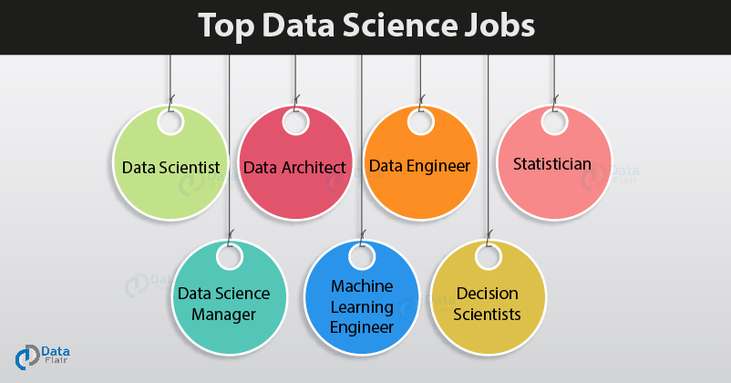

# There are several specific types of data science jobs
## Can these types be depicted from the descriptions?
## Using clustering algorithms and natural langauge processing, we can answer this question

# The dataset:
Job information was scraped from Linkedin from CA, CO, FL, NY, and UT using selenium and beautiful soup.

<div>
<style scoped>
    .dataframe tbody tr th:only-of-type {
        vertical-align: middle;
    }

    .dataframe tbody tr th {
        vertical-align: top;
    }

    .dataframe thead th {
        text-align: right;
    }
</style>
<table border="1" class="dataframe">
  <thead>
    <tr style="text-align: right;">
      <th></th>
      <th>Job_Title</th>
      <th>Company</th>
      <th>Location</th>
      <th>Number_of_Applicants</th>
      <th>Description</th>
      <th>Length_of_Description</th>
      <th>Senior</th>
      <th>Junior</th>
      <th>Senior_Junior_or_not</th>
      <th>num_applicants</th>
      <th>State</th>
    </tr>
    <tr>
      <th>Unnamed: 0</th>
      <th></th>
      <th></th>
      <th></th>
      <th></th>
      <th></th>
      <th></th>
      <th></th>
      <th></th>
      <th></th>
      <th></th>
      <th></th>
    </tr>
  </thead>
  <tbody>
    <tr>
      <th>0</th>
      <td>Data Acquisition Developer</td>
      <td>ABB</td>
      <td>Broomfield, CO, US</td>
      <td>Be among the first 25 applicants</td>
      <td>Join ABB and work in a team that is dedicated ...</td>
      <td>7321</td>
      <td>0</td>
      <td>0</td>
      <td>2</td>
      <td>20</td>
      <td>CO</td>
    </tr>
  </tbody>
</table>
</div>


```python

```


# Data cleaning pipeline:
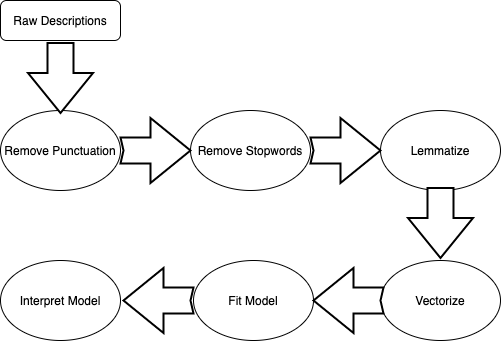

* Words that should not help differentiate the jobs from each other were identified (e.g. equal, disability)
    * These were words that were included in just about every job

* Cleaning descriptions
    * Remove punctuation using NLTK's RegexpTokenizer
    * Remove stop words (including NLTK's default stop words and my identified stop words)
    * Lemmatize each word using NLTK's WordNetLemmatizer
        * Reduces similar words (both semanticly and grammaticly related words) to a single word

## Words with only punctuation removed
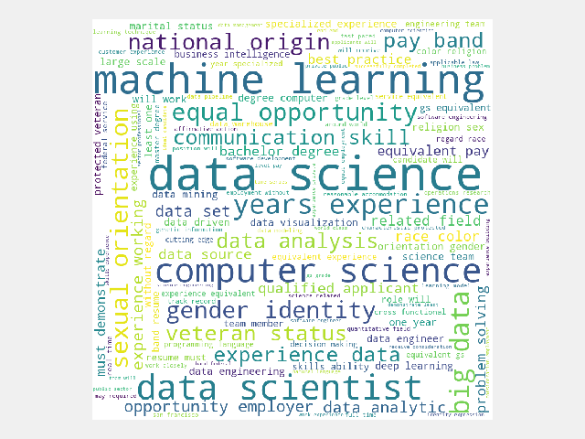

## Words after cleaning pipeline
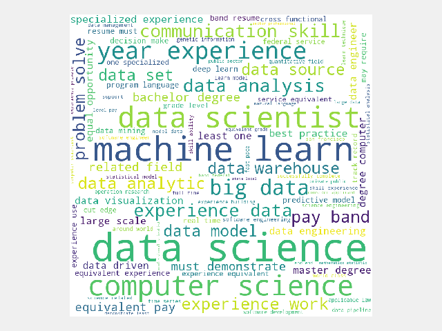

* Transform the words into counts using SKLearn's count vectorizer and the tfidf vectorizer
    * Some models require an unstandardized count of each word
    * Other models require a count standardized by how often that word occurs in the corpus

    * Removed words that occured in less than 15% of documents
    * Also removed words that occured in more than 75% of documents
    * Only kept 5000 of the most frequent words

## Top 10 words and their frequencies
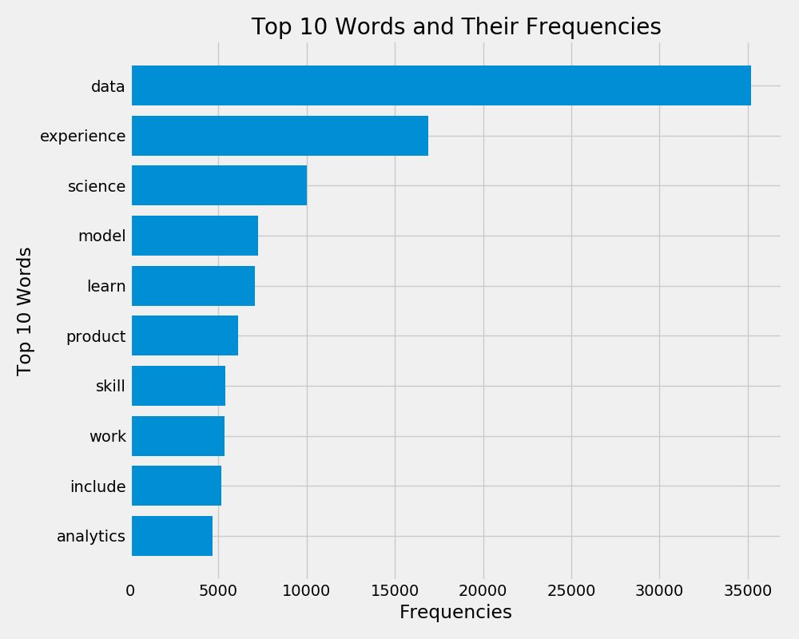


## Visualizing the descriptions after vectorizing in two dimensions
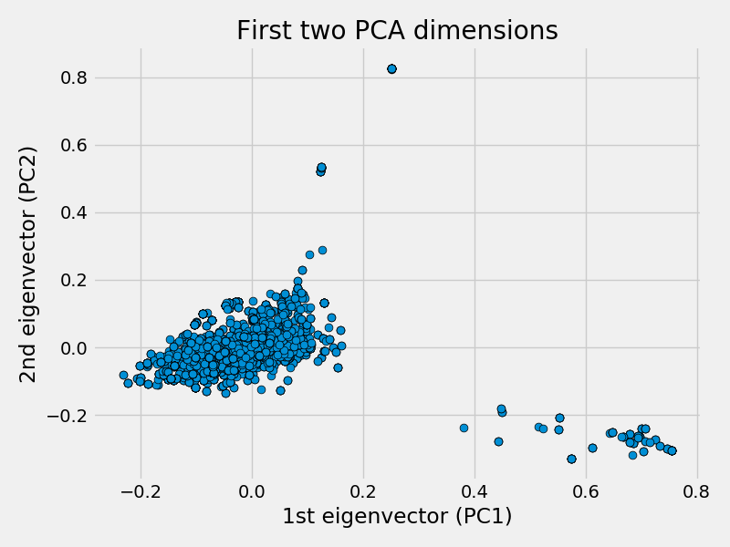
* Was hoping to identify a certain number of clusters
    * Clusters don't seem to be clear in only two dimensions

## Perhaps k-means clustering can help identify the proper number of clusters to choose
* Modeled the data using K-Means clustering with a varying number of clusters
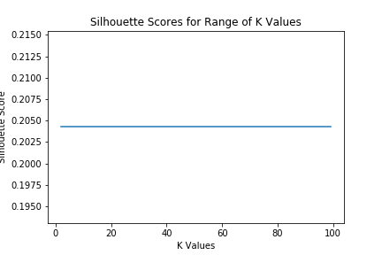

* Hoped to see a clear peak of this graph, but it appears that the model just keeps getting better and better as number of clusters increases
* Point of this project would be lost if too many clusters were extracted

## Given this data, I changed my approach from trying to numerically figure out what the best number of clusters. Instead, I decided to run several models and choose the number of clusters and type of model that seems to yield the most useful clusters.

## Most representative jobs in each of the 7 clusters in a k-means model
K-means is a hard clustering technique that determines what documents most likely belong to each cluster. The following table represents words in the descriptions that best represent the cluster of jobs. In more techinical terms, these were the words that were closest to each of the 7 cluster centers in euclidean space.

| LDS jobs  |Research jobs|Machine learning jobs| Data analysis jobs | Senior level jobs |Software engineer jobs | Marketing jobs |
|-----------|-------------|---------------------|--------------------|-------------------|-----------------------|----------------|
| ancestry  | research    | learn               | product            | system            | system                | marketing      |
| record    | analysis    | machine             | model              | position          | software              | analytics      |
| million   | program     | model               | company            | education         | engineer              | insight        |
| applicable| project     | scientist           | insight            | computer          | cloud                 | model          |
| look      | position    | ai                  | learn              | demonstrate       | service               | product        |
| create    | support     | deep                | scientist          | level             | product               | analysis       |
| law       | skill       | aws                 | analysis           | least             | design                | strategy       |


* These jobs match fairly well with my hypothesized clusters, but there seem to be some random clusters that were difficult to classify as well.
* I started looking for 3 or so clusters representing jobs that are heavy in machine learning, more research/data analysis positions, and database heavy jobs. The k-means model kept returning random clusters that didn't make much sense to me so I decided to model the data using latent dirichlet allocation - a soft clustering technique that allows descriptions to load on to multiple clusters and gives the probability that each document should be classified in each cluster.
* Using the gensim and pyLDAvis libraries in python also allows for some great visualizations of LDA clustering

## LDA Clustering

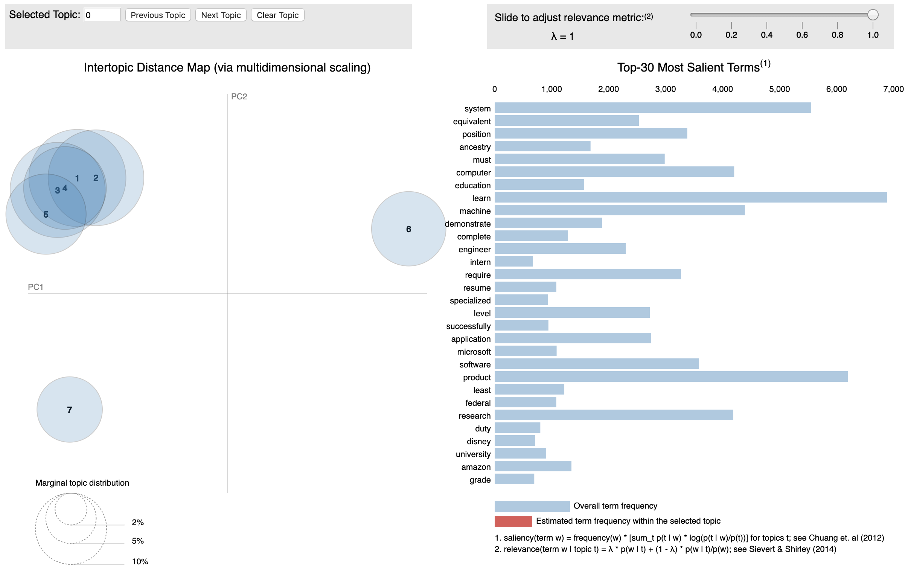
Using 7 clusters yielded topics that were almost all on top of each other. Additionally, the topics didn't seem to have clearly defined terms. Perhaps only using three clusters would be better.

Using 3 clusters produced topics that were farther apart but the words that represented the topics didn't seem to have a very cohesive connection.

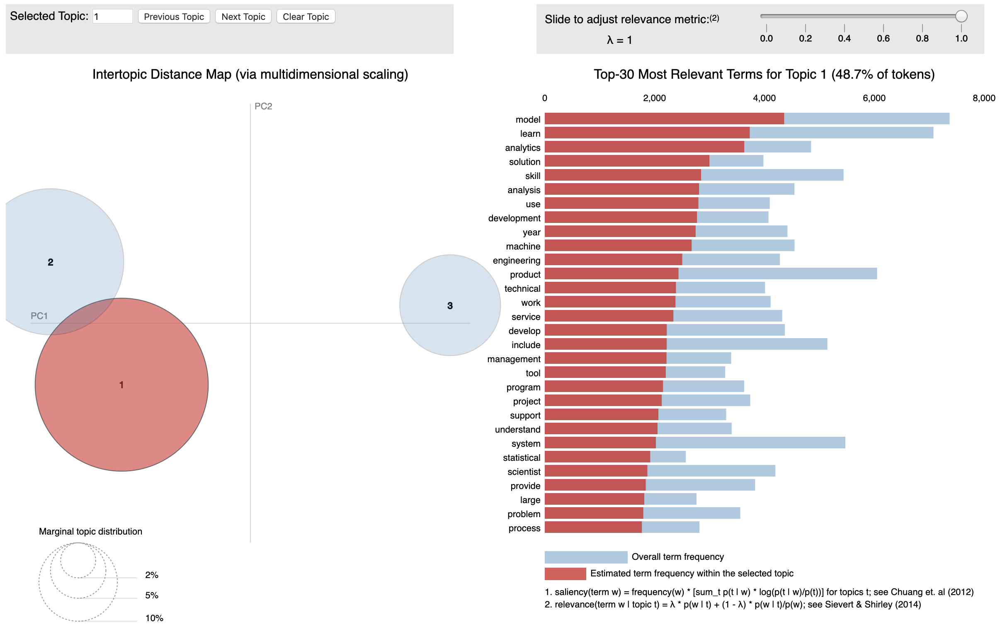

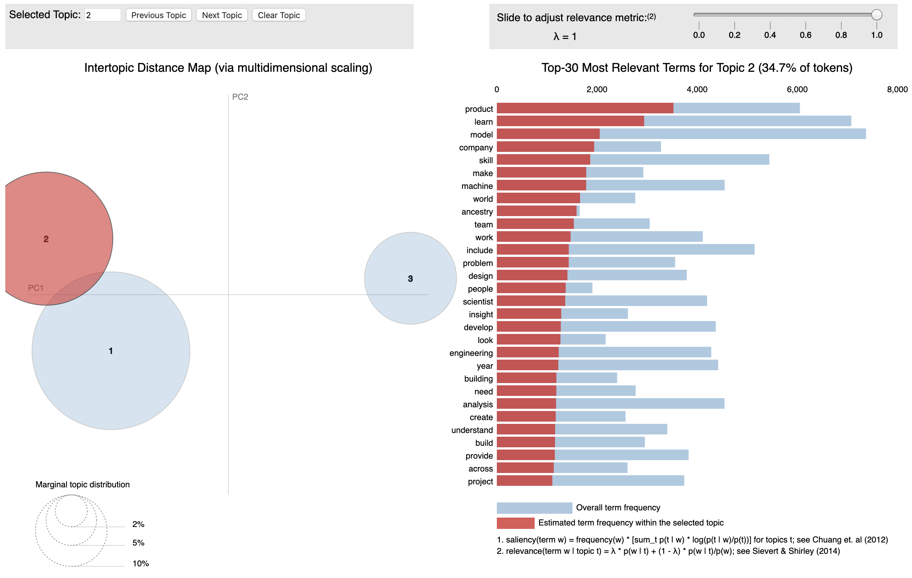

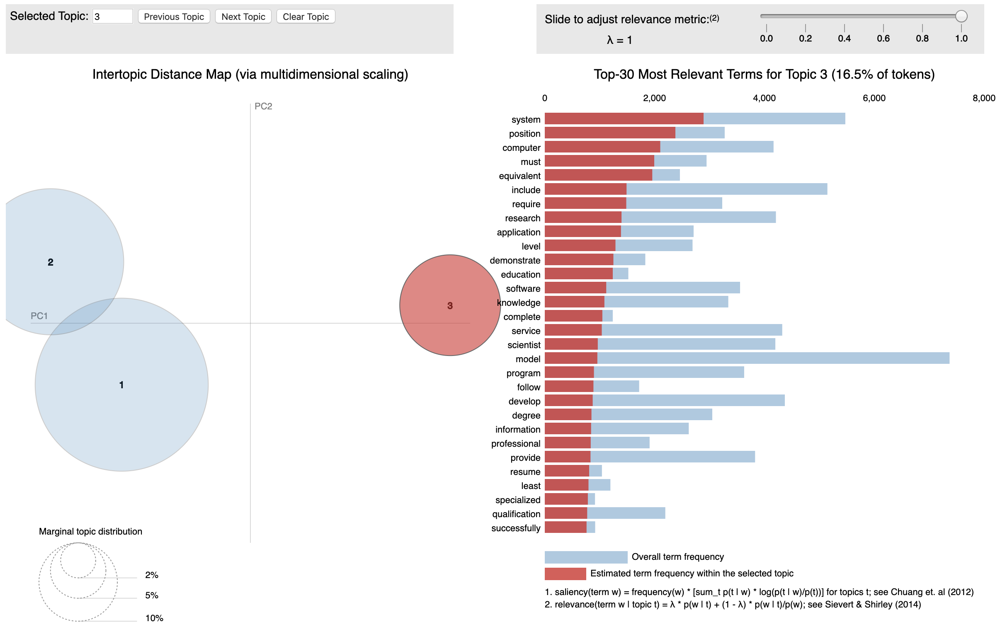

# Conclusion
* NLP is hard and stopword modification can help produce better clustering
* K-means clustering produced better clusters than did LDA
* Using clustering scores can be helpful but making sense out of this data was essential
* Python can produce some amazing visuals with not much code